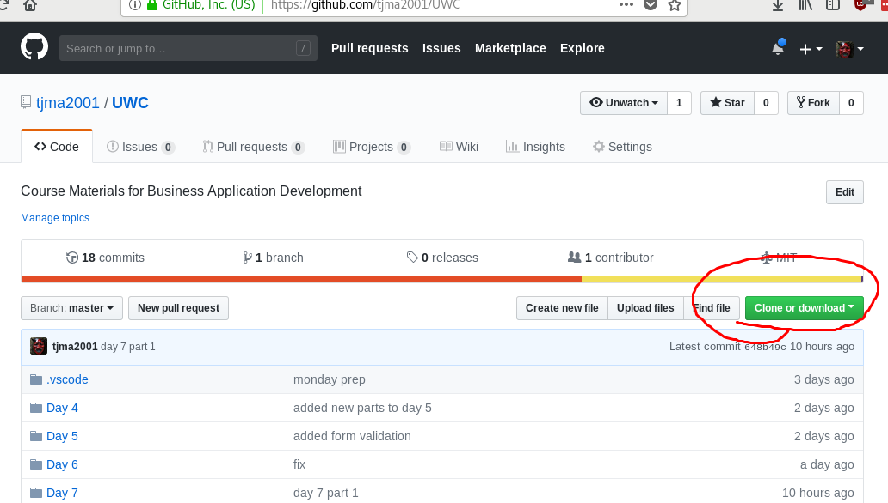

# UWC
Course Materials for Business Application Development.

This project is meant to demonstrate and teach the use of GIT, HTML, CSS and Javscript

## How to clone this project

Click the `Clone or download` button



Copy the URL


On  your command line enter:

```bash
git clone https://github.com/tjma2001/UWC.git
```

## How to connect to GIT via SSH